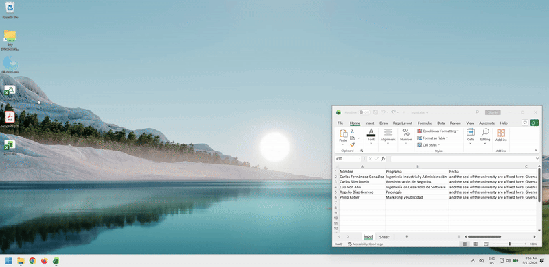

# Projects
Projects developed for my *Servicio Social*.

- [fill-docs](./fill-docs/README.md) – A desktop application to automatically fill PDF form fields using data from a CSV file.

## Design

- **User Interface:** Uses the `Gooey` library to automatically transform a standard terminal interface (`argparse`) into a user-friendly graphical user interface (GUI).
- **PDF Processing:** Built with `pypdf`, which reads values from an input `.csv` file, maps them to the editable form fields, and performs a **flattening** process to make the output PDFs read-only.
- **CI/CD & Distribution:** A GitHub Action provisions a Windows virtual machine, utilizes the fast package manager `uv` to install Python dependencies, and uses `PyInstaller` to bundle everything into a standalone Windows binary (`.exe`) for easy distribution.

## Demo

